智能助手设计文档：个人单机版（V4.0）

文档信息
项           内容
文档版本     V4.0（架构重构版，统一执行入口，事件驱动架构，提示词模板化管理）

适用场景     个人本地运行的智能助手，动态任务适配与能力调用，支持桌面端客户端

核心目标     1. 任务复杂度自动分级；2. 统一执行入口智能路由；3. 标准化调用 MCP/Skill 能力；4. 事件驱动架构；5. 提示词模板化管理；6. 提供RESTful API和WebSocket服务

更新日期     2026-03-01

V4.0 更新内容
- 统一执行入口：simple/complex 任务统一使用 PlanReActEngine，通过智能路由区分处理
- 引擎继承体系：PlanReActCore 继承 ReActCore，复用执行逻辑，减少代码重复
- 事件驱动架构：新增 ConsoleSubscriber，统一控制台/WebSocket/会话存储的输出处理
- 提示词模板化：PromptTemplates 类统一管理所有提示词，支持上下文缓存
- 方法简化：移除 _execute_task_sync，统一使用 _execute_task_stream 通过 stream 参数控制
- ReActEngine 废弃：标记为 deprecated，引导使用 PlanReActEngine

一、核心设计理念

1.1 设计原则（个人版简化）
原则   说明   个人版调整
轻量优先   减少依赖，单进程可运行   移除分布式、微服务设计

功能完整   核心功能不缺失   保留任务分级、动态模式、能力调用

易维护   配置简单，日志本地化   SQLite存储，文件日志

可扩展   预留扩展接口   支持后续添加新能力

1.2 架构

个人版架构（V4.0 事件驱动架构）：
用户输入 → 任务分析 → 模式选择 → 执行引擎 → 能力调用 → 结果输出
              │         │           │           │
              ▼         ▼           ▼           ▼
         本地SQLite  配置文件    事件发布者   MCP/Skill注册表
              │                      │
              │         ┌────────────┼────────────┐
              │         ▼            ▼            ▼
              │    ConsoleSub   WebSocketSub  SessionStoreSub
              │    (控制台)      (前端)        (存储)
              ▼
         (单进程，轻量级)

二、系统架构设计

2.1 整体架构（V4.0 事件驱动版）

graph TD
    A[用户输入] --> B[任务分析层]
    B --> C[执行模式选择层]
    C --> D[执行引擎层]
    D --> E[能力调用层]
    E --> F[能力注册表 SQLite]
    F --> E
    E --> D
    D --> G[事件发布者]
    G --> H1[控制台输出]
    G --> H2[WebSocket推送]
    G --> H3[会话存储]
    
    %% 辅助模块
    I[本地日志文件] --> B
    I --> D
    I --> E
    J[配置文件 YAML] --> C
    J --> D
    
    %% 会话管理
    K[会话管理模块] --> B
    K --> D
    
    %% 提示词模板
    L[PromptTemplates] --> D
    L --> B

2.2 各模块核心职责（V4.0）
模块   核心职责   V4.0 更新说明
用户输入层   接收命令行/GUI输入，基础清洗   支持CLI和WebSocket

任务分析层   任务分级（三级）+ 统一分析   一次LLM调用完成分类+计划+行动

执行模式选择层   选择 DirectEngine 或 PlanReActEngine   simple/complex 统一使用 PlanReActEngine

执行引擎层   智能路由执行，支持断点恢复   PlanReActCore 继承 ReActCore

能力调用层   MCP/Skill标准化调用   简化鉴权，本地配置

事件发布者   发布执行过程中的事件   新增，统一事件驱动架构

控制台订阅者   监听事件，输出到控制台   新增，替代手动流式处理

WebSocket订阅者   监听事件，推送到前端   复用现有逻辑

会话存储订阅者   监听事件，保存到数据库   新增，解耦存储逻辑

提示词模板   统一管理所有LLM提示词   新增，支持上下文缓存

会话管理模块   本地会话历史与检查点   SQLite+内存，单用户

日志模块   本地文件日志   按天轮转，无需监控系统

配置中心   YAML配置文件   单文件配置，易修改

三、核心模块详细设计

3.1 任务分析层（简化：三级分类）

3.1.1 任务特征维度（个人版）
特征维度   Trivial（直接回答）   Simple（单工具）   Complex（多工具）
步骤清晰度   无步骤/闲聊   单一步骤   多步骤、有依赖

工具调用数   0   1   ≥2

交互需求   无需   无需/单轮   多轮澄清

示例   "你好""今天星期几"   "查北京天气"   "规划旅行""分析数据"

说明：个人版移除Critical级别，高风险操作通过配置手动控制

3.1.2 分类策略（简化版）

任务分类流程图：

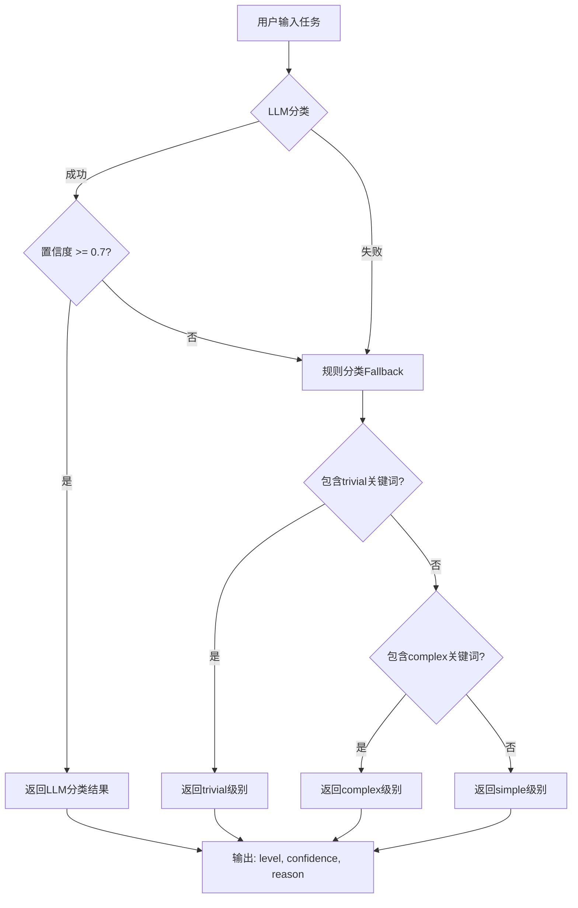
```mermaid
flowchart TD
    A[用户输入任务] --> B{LLM分类}
    B -->|成功| C{置信度 >= 0.7?}
    B -->|失败| D[规则分类Fallback]
    C -->|是| E[返回LLM分类结果]
    C -->|否| D
    
    D --> F{包含trivial关键词?}
    F -->|是| G[返回trivial级别]
    F -->|否| H{包含complex关键词?}
    H -->|是| I[返回complex级别]
    H -->|否| J[返回simple级别]
    
    E --> K[输出: level, confidence, reason]
    G --> K
    I --> K
    J --> K
```

分类规则说明：
- **trivial关键词**：你好、谢谢、再见、是谁、什么是
- **complex关键词**：规划、分析、对比、总结、多步骤
- **默认级别**：当关键词都不匹配时，返回simple级别

3.2 会话管理模块（简化版）

3.2.1 本地会话存储

会话管理架构图：

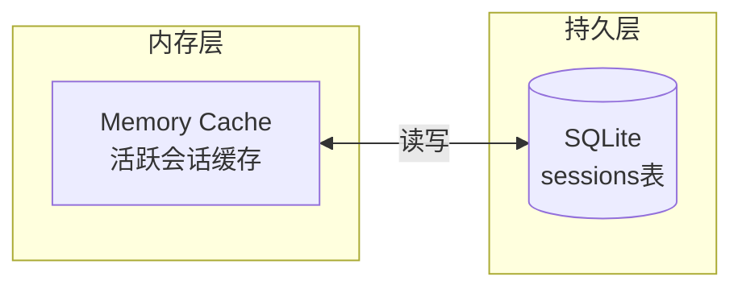
```mermaid
flowchart LR
    subgraph 内存层
        A[Memory Cache<br/>活跃会话缓存]
    end
    
    subgraph 持久层
        B[(SQLite<br/>sessions表)]
    end
    
    A <-->|读写| B
```

会话数据流程图：

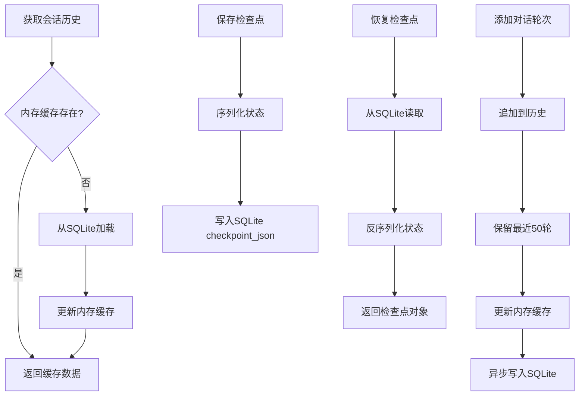
```mermaid
flowchart TD
    A[获取会话历史] --> B{内存缓存存在?}
    B -->|是| C[返回缓存数据]
    B -->|否| D[从SQLite加载]
    D --> E[更新内存缓存]
    E --> C
    
    F[添加对话轮次] --> G[追加到历史]
    G --> H[保留最近50轮]
    H --> I[更新内存缓存]
    I --> J[异步写入SQLite]
    
    K[保存检查点] --> L[序列化状态]
    L --> M[写入SQLite checkpoint_json]
    
    N[恢复检查点] --> O[从SQLite读取]
    O --> P[反序列化状态]
    P --> Q[返回检查点对象]
```

检查点生命周期：

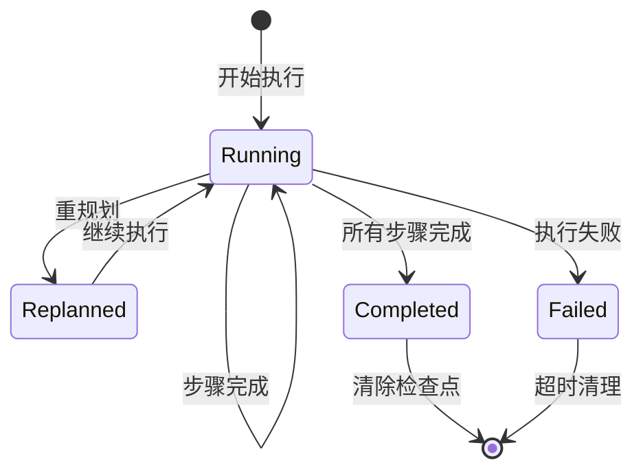
```mermaid
stateDiagram-v2
    [*] --> Running: 开始执行
    Running --> Running: 步骤完成
    Running --> Replanned: 重规划
    Replanned --> Running: 继续执行
    Running --> Completed: 所有步骤完成
    Running --> Failed: 执行失败
    Completed --> [*]: 清除检查点
    Failed --> [*]: 超时清理
```

核心接口说明：
- `get_history(session_id, max_turns)`：获取最近N轮对话历史
- `add_turn(session_id, role, content)`：添加对话轮次
- `save_checkpoint(session_id, state)`：保存执行检查点
- `restore_checkpoint(session_id)`：恢复检查点
- `cleanup_expired_checkpoints(ttl_hours)`：清理过期检查点

3.3 执行模式选择层（V4.0 统一入口）

3.3.1 模式选择规则（V4.0 优化）
任务分级   执行引擎   处理方式   配置参数
trivial   DirectEngine   直接LLM回答   max_tokens=1000

simple   PlanReActEngine   智能路由 → 直接执行 next_action   max_plan_steps=3, max_loop_per_step=3

complex   PlanReActEngine   智能路由 → 执行多步计划   max_plan_steps=8, max_loop_per_step=5

V4.0 关键优化：
- simple/complex 统一使用 PlanReActEngine
- 通过智能路由区分处理方式，减少代码分支
- simple 任务直接执行 next_action，减少 1 次 LLM 调用
- ReActEngine 标记为废弃，引导使用 PlanReActEngine

3.3.2 执行模式选择器实现

执行模式选择流程图：

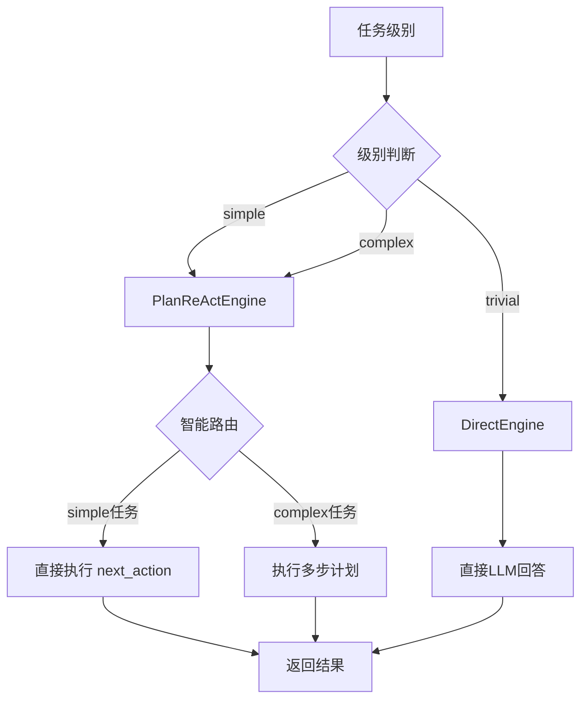
```mermaid
flowchart TD
    A[任务级别] --> B{级别判断}
    B -->|trivial| C[DirectEngine]
    B -->|simple| D[PlanReActEngine]
    B -->|complex| D
    
    C --> E[直接LLM回答]
    D --> F{智能路由}
    F -->|simple任务| G[直接执行 next_action]
    F -->|complex任务| H[执行多步计划]
    
    G --> I[返回结果]
    H --> I
    E --> I
```

模型分级选择流程：

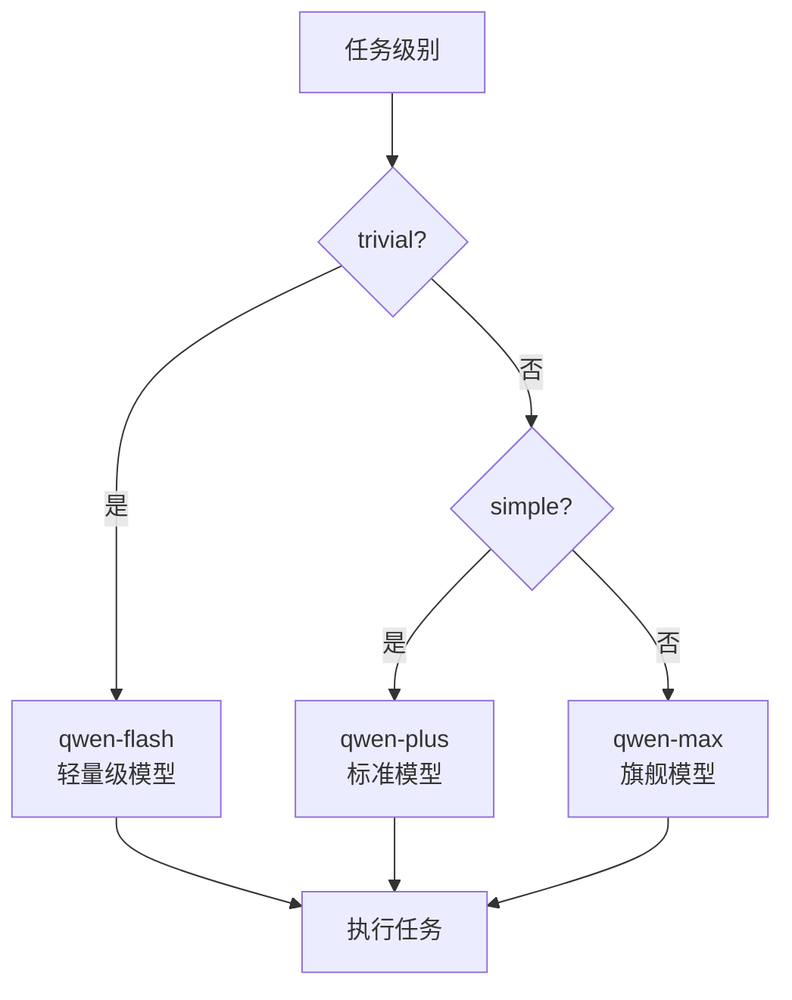
```mermaid
flowchart TD
    A[任务级别] --> B{trivial?}
    B -->|是| C[qwen-flash<br/>轻量级模型]
    B -->|否| D{simple?}
    D -->|是| E[qwen-plus<br/>标准模型]
    D -->|否| F[qwen-max<br/>旗舰模型]
    
    C --> G[执行任务]
    E --> G
    F --> G
```

模型分级与成本优化：

| 任务级别 | 推荐模型 | 输入价格 | 输出价格 | 适用场景 |
|---------|---------|---------|---------|---------|
| trivial | qwen-flash | 0.15元/百万Token | 1.5元/百万Token | 问候、闲聊、简单问答 |
| simple | qwen-plus | 0.8元/百万Token | 2元/百万Token | 单工具调用、信息查询 |
| complex | qwen-max | 2.5元/百万Token | 10元/百万Token | 多工具协同、复杂推理 |

成本优化分析（假设每日任务分布：trivial 60%, simple 30%, complex 10%）：
- 不分级成本：0.8元/百万Token
- 分级后成本：0.515元/百万Token
- **节省成本：35.6%**

3.3.3 配置文件示例

config.yaml - 个人版配置文件

LLM配置（支持模型分级）
llm:
  provider: "dashscope"  # openai/dashscope/azure/google
  base_url: "https://dashscope.aliyuncs.com/compatible-mode/v1"
  api_key: "{DASHSCOPE_API_KEY}"  # 支持环境变量
  max_tokens: 4000
  temperature: 0.7
  timeout: 30

  # 模型分级配置（根据任务难度自动选择）
  models:
    trivial:
      model: "qwen-flash"  # 简单任务使用轻量级模型
      max_tokens: 1000
      temperature: 0.7

    simple:
      model: "qwen-plus"  # 中等任务使用标准模型
      max_tokens: 2000
      temperature: 0.7

    complex:
      model: "qwen-max"  # 复杂任务使用最强模型
      max_tokens: 4000
      temperature: 0.5

  # 默认模型（当任务级别未知时使用）
  default_model: "qwen-plus"

模型分级说明：
- trivial任务（问候、闲聊）：使用qwen-flash，速度快、成本低
- simple任务（单工具调用）：使用qwen-plus，效果、速度、成本均衡
- complex任务（多工具、多步骤）：使用qwen-max，能力最强，适合复杂推理

阿里云百炼模型规格：
| 模型 | 适用场景 | 最大上下文 | 输入价格 | 输出价格 |
|------|---------|-----------|---------|---------|
| qwen-max | 复杂任务 | 262,144 | 2.5元/百万Token | 10元/百万Token |
| qwen-plus | 通用场景 | 1,000,000 | 0.8元/百万Token | 2元/百万Token |
| qwen-flash | 简单任务 | 1,000,000 | 0.15元/百万Token | 1.5元/百万Token |
| qwen-coder | 代码任务 | 1,000,000 | 1元/百万Token | 4元/百万Token |

任务分类配置
task_classification:
  strategy: "llm_first"
  llm_confidence_threshold: 0.7
  fallback_to_rule: true

执行模式配置（V4.0 统一入口）
execution_mode:
  trivial:
    name: "direct"
    max_tokens: 1000
    
  simple:
    name: "plan_react"  # V4.0: 统一使用 plan_react
    max_plan_steps: 3
    max_loop_per_step: 3
    
  complex:
    name: "plan_react"
    max_plan_steps: 8
    max_loop_per_step: 5
    enable_replanning: true
    max_replan_count: 2
    max_step_retries: 3

能力调用配置
skill_call:
  default_timeout: 30
  retry_count: 1
  verify_ssl: true

会话配置
session:
  db_path: "data/assistant.db"
  max_history_turns: 50
  checkpoint_ttl_hours: 24

日志配置
logging:
  level: "INFO"
  file_path: "logs/assistant.log"
  max_file_size_mb: 10
  backup_count: 5
  format: "%(asctime)s - %(levelname)s - %(message)s"

3.4 执行引擎层（V4.0 架构重构）

3.4.1 引擎继承体系

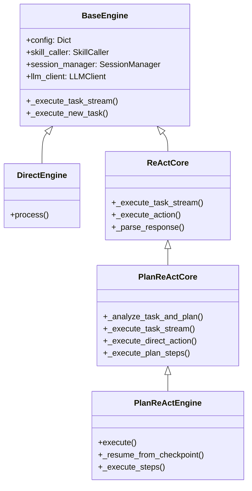
```mermaid
classDiagram
    class BaseEngine {
        +config: Dict
        +skill_caller: SkillCaller
        +session_manager: SessionManager
        +llm_client: LLMClient
        +_execute_task_stream()
        +_execute_new_task()
    }
    
    class DirectEngine {
        +process()
    }
    
    class ReActCore {
        +_execute_task_stream()
        +_execute_action()
        +_parse_response()
    }
    
    class PlanReActCore {
        +_analyze_task_and_plan()
        +_execute_task_stream()
        +_execute_direct_action()
        +_execute_plan_steps()
    }
    
    class PlanReActEngine {
        +execute()
        +_resume_from_checkpoint()
        +_execute_steps()
    }
    
    BaseEngine <|-- DirectEngine
    BaseEngine <|-- ReActCore
    ReActCore <|-- PlanReActCore
    PlanReActCore <|-- PlanReActEngine
```

关键设计：
- PlanReActCore 继承 ReActCore，复用执行逻辑
- 子类只需实现 _execute_task_stream 方法
- 移除 _execute_task_sync，统一通过 stream 参数控制

3.4.2 执行流程时序图

Simple任务执行时序（V4.0优化后）：

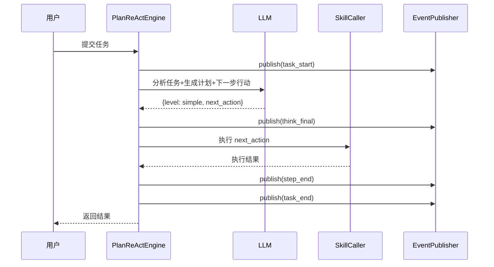
```mermaid
sequenceDiagram
    participant U as 用户
    participant E as PlanReActEngine
    participant L as LLM
    participant S as SkillCaller
    participant P as EventPublisher
    
    U->>E: 提交任务
    E->>P: publish(task_start)
    E->>L: 分析任务+生成计划+下一步行动
    L-->>E: {level: simple, next_action}
    E->>P: publish(think_final)
    E->>S: 执行 next_action
    S-->>E: 执行结果
    E->>P: publish(step_end)
    E->>P: publish(task_end)
    E-->>U: 返回结果
```

Complex任务执行时序：

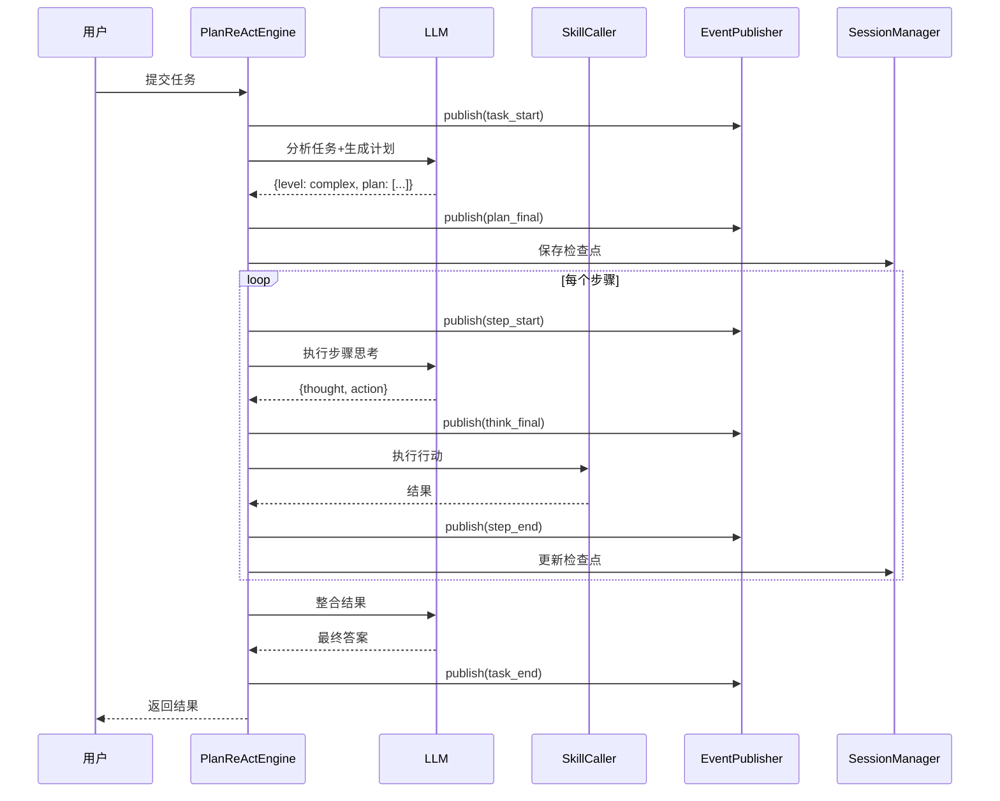
```mermaid
sequenceDiagram
    participant U as 用户
    participant E as PlanReActEngine
    participant L as LLM
    participant S as SkillCaller
    participant P as EventPublisher
    participant DB as SessionManager
    
    U->>E: 提交任务
    E->>P: publish(task_start)
    E->>L: 分析任务+生成计划
    L-->>E: {level: complex, plan: [...]}
    E->>P: publish(plan_final)
    E->>DB: 保存检查点
    
    loop 每个步骤
        E->>P: publish(step_start)
        E->>L: 执行步骤思考
        L-->>E: {thought, action}
        E->>P: publish(think_final)
        E->>S: 执行行动
        S-->>E: 结果
        E->>P: publish(step_end)
        E->>DB: 更新检查点
    end
    
    E->>L: 整合结果
    L-->>E: 最终答案
    E->>P: publish(task_end)
    E-->>U: 返回结果
```

断点恢复时序：

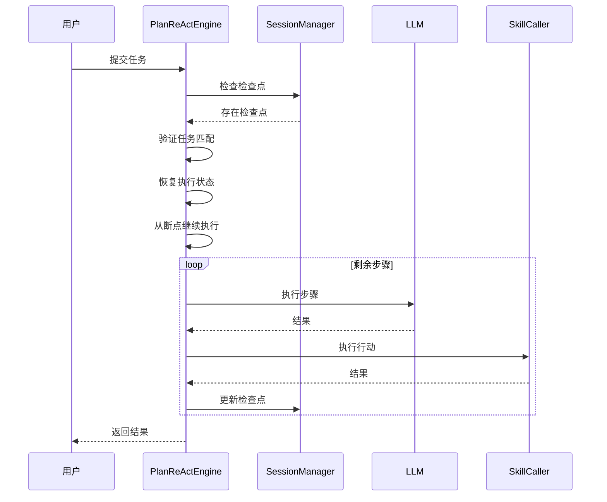
```mermaid
sequenceDiagram
    participant U as 用户
    participant E as PlanReActEngine
    participant DB as SessionManager
    participant L as LLM
    participant S as SkillCaller
    
    U->>E: 提交任务
    E->>DB: 检查检查点
    DB-->>E: 存在检查点
    E->>E: 验证任务匹配
    E->>E: 恢复执行状态
    E->>E: 从断点继续执行
    loop 剩余步骤
        E->>L: 执行步骤
        L-->>E: 结果
        E->>S: 执行行动
        S-->>E: 结果
        E->>DB: 更新检查点
    end
    E-->>U: 返回结果
```

3.4.3 执行流程对比

| 版本 | Simple任务LLM调用 | Complex任务LLM调用 | 优化效果 |
|-----|------------------|-------------------|---------|
| V3.0 | 分类(1) + 执行(1) = 2次 | 分类(1) + 计划(1) + 执行(N) = N+2次 | - |
| V4.0 | 分析+行动(1) = 1次 | 分析+计划(1) + 执行(N) = N+1次 | **减少50%/1次** |

3.4.4 重规划流程

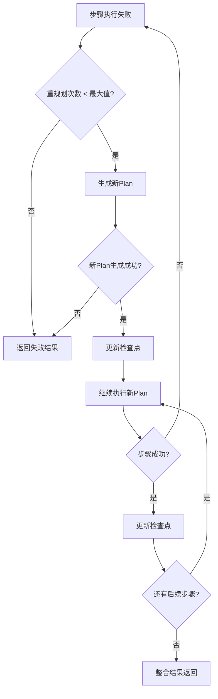
```mermaid
flowchart TD
    A[步骤执行失败] --> B{重规划次数 < 最大值?}
    B -->|是| C[生成新Plan]
    B -->|否| D[返回失败结果]
    
    C --> E{新Plan生成成功?}
    E -->|是| F[更新检查点]
    E -->|否| D
    
    F --> G[继续执行新Plan]
    G --> H{步骤成功?}
    H -->|是| I[更新检查点]
    H -->|否| A
    
    I --> J{还有后续步骤?}
    J -->|是| G
    J -->|否| K[整合结果返回]
```

3.5 能力调用层（简化版）

3.5.1 能力注册表架构

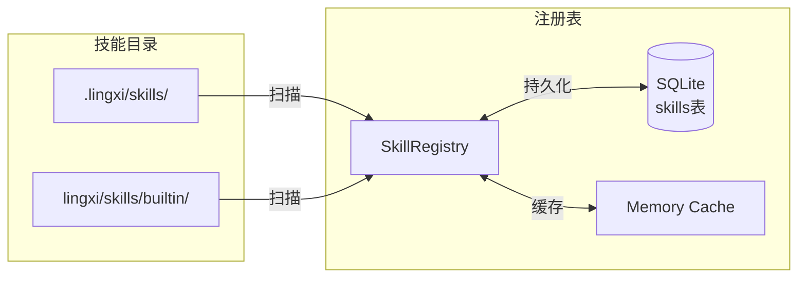
```mermaid
flowchart LR
    subgraph 技能目录
        A[.lingxi/skills/]
        B[lingxi/skills/builtin/]
    end
    
    subgraph 注册表
        C[SkillRegistry]
        D[(SQLite<br/>skills表)]
        E[Memory Cache]
    end
    
    A -->|扫描| C
    B -->|扫描| C
    C <-->|持久化| D
    C <-->|缓存| E
```

技能调用流程：

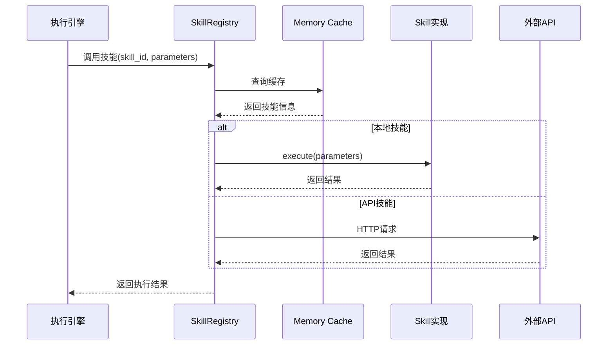
```mermaid
sequenceDiagram
    participant E as 执行引擎
    participant R as SkillRegistry
    participant C as Memory Cache
    participant S as Skill实现
    participant API as 外部API
    
    E->>R: 调用技能(skill_id, parameters)
    R->>C: 查询缓存
    C-->>R: 返回技能信息
    
    alt 本地技能
        R->>S: execute(parameters)
        S-->>R: 返回结果
    else API技能
        R->>API: HTTP请求
        API-->>R: 返回结果
    end
    
    R-->>E: 返回执行结果
```

技能类型说明：

| 类型 | 标识 | 执行方式 | 示例 |
|-----|-----|---------|-----|
| 本地技能 | local | 直接调用Python函数 | 文件读写、计算器 |
| API技能 | api | HTTP请求调用 | 天气查询、网页搜索 |
| MCP技能 | mcp | MCP协议调用 | 数据库操作、系统命令 |
        cursor.execute("""
            INSERT OR REPLACE INTO skills 
            (skill_id, skill_name, version, api_url, api_key, input_schema, description)
            VALUES (?, ?, ?, ?, ?, ?, ?)
        """, (
            skill["skill_id"],
            skill["skill_name"],
            skill.get("version", "v1"),
            skill["api_url"],
            skill.get("api_key", ""),
            json.dumps(skill.get("input_schema")),
            skill.get("description", "")
        ))
        conn.commit()
        conn.close()
        self._load_to_cache()  # 刷新缓存
        return True
    
    def get_skill(self, skill_id: str) -> dict:
        """获取技能信息"""
        return self.skill_cache.get(skill_id)
    
    def call(self, skill_id: str, parameters: dict) -> dict:
        """调用技能"""
        skill = self.get_skill(skill_id)
        if not skill:
            return {"success": False, "error": f"技能{skill_id}不存在"}
        
        if not skill["enabled"]:
            return {"success": False, "error": f"技能{skill_id}已禁用"}
        
        # 简化调用逻辑
        try:
            headers = {}
            if skill["api_key"]:
                headers["Authorization"] = f"Bearer {skill['api_key']}"
            
            response = requests.post(
                skill["api_url"],
                json=parameters,
                headers=headers,
                timeout=30
            )
            
            if response.status_code == 200:
                return {"success": True, "data": response.json()}
            else:
                return {"success": False, "error": f"HTTP {response.status_code}: {response.text}"}
                
        except Exception as e:
            return {"success": False, "error": str(e)}
    
    def list_skills(self) -> list:
        """列出所有可用技能"""
        return [
            {"skill_id": s["skill_id"], "skill_name": s["skill_name"], 
             "description": s["description"]}
            for s in self.skill_cache.values()
        ]

3.5.2 内置技能示例

builtin_skills.py - 个人版内置技能

BUILTIN_SKILLS = [
    {
        "skill_id": "web.search",
        "skill_name": "网页搜索",
        "version": "v1",
        "api_url": "https://api.example.com/search",
        "api_key": "{SEARCH_API_KEY}",
        "input_schema": {
            "type": "object",
            "properties": {
                "query": {"type": "string"},
                "num_results": {"type": "integer", "default": 5}
            },
            "required": ["query"]
        },
        "description": "搜索互联网信息"
    },
    {
        "skill_id": "weather.query",
        "skill_name": "天气查询",
        "version": "v1",
        "api_url": "https://api.weather.com/v1/query",
        "api_key": "{WEATHER_API_KEY}",
        "input_schema": {
            "type": "object",
            "properties": {
                "city": {"type": "string"},
                "date": {"type": "string", "format": "date"}
            },
            "required": ["city"]
        },
        "description": "查询指定城市天气"
    },
    {
        "skill_id": "file.read",
        "skill_name": "文件读取",
        "version": "v1",
        "api_url": "local://file/read",  # 本地技能标记
        "api_key": "",
        "input_schema": {
            "type": "object",
            "properties": {
                "file_path": {"type": "string"}
            },
            "required": ["file_path"]
        },
        "description": "读取本地文件内容"
    },
    {
        "skill_id": "calculator.compute",
        "skill_name": "计算器",
        "version": "v1",
        "api_url": "local://calculator",
        "api_key": "",
        "input_schema": {
            "type": "object",
            "properties": {
                "expression": {"type": "string"}
            },
            "required": ["expression"]
        },
        "description": "执行数学计算"
    }
]

def register_builtin_skills(registry: SkillRegistry):
    """注册内置技能"""
    for skill in BUILTIN_SKILLS:
        # 替换环境变量
        if skill["api_key"].startswith("{"):
            env_var = skill["api_key"][2:-1]
            skill["api_key"] = os.environ.get(env_var, "")
        registry.register(skill)

3.6 日志模块（简化版）

logging_config.py - 个人版日志配置

import logging
from logging.handlers import RotatingFileHandler
import os

def setup_logging(config: dict):
    """设置日志"""
    log_dir = os.path.dirname(config["file_path"])
    os.makedirs(log_dir, exist_ok=True)
    
    logger = logging.getLogger("assistant")
    logger.setLevel(getattr(logging, config["level"]))
    
    # 文件处理器（轮转）
    file_handler = RotatingFileHandler(
        config["file_path"],
        maxBytes=config["max_file_size_mb"] * 1024 * 1024,
        backupCount=config["backup_count"]
    )
    file_handler.setFormatter(logging.Formatter(config["format"]))
    logger.addHandler(file_handler)
    
    # 控制台处理器
    console_handler = logging.StreamHandler()
    console_handler.setFormatter(logging.Formatter("%(asctime)s - %(levelname)s - %(message)s"))
    logger.addHandler(console_handler)
    
    return logger

全局日志对象
log = None

def init_logging(config_path: str = "config.yaml"):
    global log
    config = load_yaml(config_path)
    log = setup_logging(config.logging)
    return log

def log_info(msg: str):
    if log:
        log.info(msg)

def log_warning(msg: str):
    if log:
        log.warning(msg)

def log_error(msg: str):
    if log:
        log.error(msg)

def log_debug(msg: str):
    if log:
        log.debug(msg)

四、数据设计（简化版）

4.1 数据库结构（SQLite）

-- data/schema.sql - 个人版数据库结构

-- 会话表
CREATE TABLE IF NOT EXISTS sessions (
    session_id TEXT PRIMARY KEY,
    user_name TEXT DEFAULT 'default',
    history_json TEXT,
    checkpoint_json TEXT,
    created_at TIMESTAMP DEFAULT CURRENT_TIMESTAMP,
    updated_at TIMESTAMP DEFAULT CURRENT_TIMESTAMP
);

-- 技能注册表
CREATE TABLE IF NOT EXISTS skills (
    skill_id TEXT PRIMARY KEY,
    skill_name TEXT NOT NULL,
    version TEXT DEFAULT 'v1',
    api_url TEXT NOT NULL,
    api_key TEXT,
    input_schema TEXT,
    description TEXT,
    enabled INTEGER DEFAULT 1,
    created_at TIMESTAMP DEFAULT CURRENT_TIMESTAMP
);

-- 执行日志表
CREATE TABLE IF NOT EXISTS execution_logs (
    log_id INTEGER PRIMARY KEY AUTOINCREMENT,
    session_id TEXT,
    task_text TEXT,
    task_level TEXT,
    execution_mode TEXT,
    skill_calls_json TEXT,
    result TEXT,
    tokens_used INTEGER,
    execute_time REAL,
    status TEXT,
    error_info TEXT,
    created_at TIMESTAMP DEFAULT CURRENT_TIMESTAMP
);

-- 索引
CREATE INDEX IF NOT EXISTS idx_sessions_updated ON sessions(updated_at);
CREATE INDEX IF NOT EXISTS idx_logs_created ON execution_logs(created_at);
CREATE INDEX IF NOT EXISTS idx_logs_session ON execution_logs(session_id);

4.2 目录结构

assistant/
├── main.py                 # 主入口
├── config.yaml             # 配置文件
├── requirements.txt        # 依赖列表
├── data/
│   ├── assistant.db        # 会话数据库
│   ├── skills.db           # 技能注册表
│   └── schema.sql          # 数据库结构
├── logs/
│   └── assistant.log       # 日志文件
├── src/
│   ├── classifier.py       # 任务分类器
│   ├── engine/
│   │   ├── react.py        # ReAct引擎
│   │   └── plan_react.py   # Plan+ReAct引擎
│   ├── skills/
│   │   ├── registry.py     # 技能注册表
│   │   └── builtin.py      # 内置技能
│   ├── session.py          # 会话管理
│   └── llm_client.py       # LLM客户端
└── tests/
    └── test_*.py           # 测试文件

五、接口设计（简化版）

5.1 命令行接口（CLI）

main.py - 个人版主入口

import argparse
from src.classifier import TaskClassifier
from src.engine.react import ReActEngine
from src.engine.plan_react import PlanReActEngine
from src.skills.registry import SkillRegistry
from src.session import SessionManager
from src.logging_config import init_logging, log_info, log_error

def main():
    parser = argparse.ArgumentParser(description="个人智能助手")
    parser.add_argument("--config", default="config.yaml", help="配置文件路径")
    parser.add_argument("--session", default="default", help="会话ID（默认：default）")
    parser.add_argument("--interactive", action="store_true", help="交互模式")
    parser.add_argument("--task", type=str, help="单次任务（非交互模式）")
    args = parser.parse_args()
    
    # 初始化
    log = init_logging(args.config)
    config = load_yaml(args.config)
    skill_registry = SkillRegistry("data/skills.db")
    session_manager = SessionManager("data/assistant.db")
    classifier = TaskClassifier(args.config)
    
    # 注册内置技能
    from src.skills.builtin import register_builtin_skills
    register_builtin_skills(skill_registry)
    
    log_info(f"助手启动，会话ID: {args.session}")
    
    if args.interactive:
        # 交互模式
        print("🤖 个人智能助手已启动（输入 'quit' 退出）")
        print("输入 '/help' 查看可用命令")
        print("可用命令：")
        print("  /help - 显示帮助")
        print("  /session [id] - 创建新会话或切换到指定会话")
        print("  /clear - 清空当前会话")
        print("  /status - 显示检查点状态")
        print("  /skills - 列出可用技能")
        print("  /install <path> - 安装技能")
        print("  /context-stats - 显示上下文统计")
        print("  /compress - 手动触发上下文压缩")
        print("  /search <query> - 检索相关历史")
        print("  /exit - 退出系统")
        print(f"当前会话ID: {args.session}")
        while True:
            try:
                user_input = input("n你：").strip()
                if user_input.lower() in ["quit", "exit", "q"]:
                    break
                if not user_input:
                    continue
                
                result = process_task(
                    user_input, args.session, config, 
                    classifier, skill_registry, session_manager
                )
                print(f"n助手：{result}")
                
            except KeyboardInterrupt:
                break
            except Exception as e:
                log_error(f"处理错误：{e}")
                print(f"n助手：抱歉，发生错误：{e}")
    
    elif args.task:
        # 单次任务模式
        result = process_task(
            args.task, args.session, config,
            classifier, skill_registry, session_manager
        )
        print(result)
    
    else:
        parser.print_help()

def process_task(task: str, session_id: str, config: dict, 
                 classifier, skill_registry, session_manager) -> str:
    """处理单个任务"""
    # 1. 任务分类
    classification = classifier.classify(task)
    level = classification["level"]
    log_info(f"任务分类：{level} (置信度：{classification['confidence']})")
    
    # 2. 获取会话历史
    history = session_manager.get_history(session_id)
    
    # 3. 选择执行引擎
    if level == "trivial":
        # 直接回答
        llm = LLMClient(config.llm)
        result = llm.generate(task, max_tokens=1000)
    elif level == "simple":
        # ReAct模式
        engine = ReActEngine(config, skill_registry)
        result_dict = engine.execute(task, session_id, history)
        result = result_dict.get("result", result_dict.get("error", "执行失败"))
    else:  # complex
        # Plan+ReAct模式
        engine = PlanReActEngine(config, skill_registry, session_manager)
        result_dict = engine.execute(task, session_id, history)
        result = result_dict.get("result", result_dict.get("error", "执行失败"))
    
    # 4. 保存会话
    session_manager.add_turn(session_id, "user", task)
    session_manager.add_turn(session_id, "assistant", result)
    
    # 5. 记录执行日志
    log_execution(task, level, result, session_id)
    
    return result

### 5.1.1 交互模式命令

交互模式支持以下命令：

- `/help` - 显示帮助信息
- `/session [id]` - 创建新会话或切换到指定会话
  - 不带参数：自动生成新的会话ID（格式：`session_8位十六进制`）
  - 带参数：切换到指定的会话ID（如果会话不存在则自动创建）
- `/clear` - 清空当前会话的历史记录
- `/status` - 显示当前会话的检查点状态
- `/skills` - 列出所有可用的技能
- `/install <path>` - 安装技能到系统
- `/context-stats` - 显示当前会话的上下文统计信息
- `/compress` - 手动触发上下文压缩
- `/search <query>` - 检索相关的历史记录
- `/exit` - 退出系统

**会话管理示例：**
```bash
# 启动交互模式（默认会话ID为 default）
python -m lingxi

# 创建新会话
/session
# 输出：创建新会话: session_1f733227

# 切换到指定会话
/session my_project
# 输出：切换到会话: my_project

# 查看当前会话ID
# 在交互模式启动时会显示：当前会话ID: default
```

if name == "main":
    main()

5.2 简单Web界面（可选）

web_server.py - 可选的简单Web界面

from flask import Flask, request, jsonify, render_template_string
from main import process_task
import os

app = Flask(name)

简单HTML界面
HTML_TEMPLATE = """

    个人智能助手
    
        body { font-family: Arial; max-width: 800px; margin: 50px auto; }
        #chat { border: 1px solid #ccc; height: 400px; overflow-y: auto; padding: 10px; }
        .user { color: blue; }
        .assistant { color: green; }
        #input { width: 70%; padding: 10px; }
        #send { padding: 10px 20px; }
    

    🤖 个人智能助手
    
    
    发送
    
    
        const chat = document.getElementById('chat');
        const input = document.getElementById('input');
        const sessionId = localStorage.getItem('session_id') || 'web_' + Date.now();
        localStorage.setItem('session_id', sessionId);
        
        function send() {
            const text = input.value.trim();
            if (!text) return;
            
            chat.innerHTML += '你：' + text + '';
            input.value = '';
            
            fetch('/api/query', {
                method: 'POST',
                headers: {'Content-Type': 'application/json'},
                body: JSON.stringify({task: text, session_id: sessionId})
            })
            .then(r => r.json())
            .then(data => {
                chat.innerHTML += '助手：' + data.result + '';
                chat.scrollTop = chat.scrollHeight;
            });
        }
    

"""

@app.route("/")
def index():
    return render_template_string(HTML_TEMPLATE)

@app.route("/api/query", methods=["POST"])
def query():
    data = request.json
    task = data.get("task")
    session_id = data.get("session_id", "default")
    
    if not task:
        return jsonify({"error": "任务不能为空"}), 400
    
    # 调用主处理逻辑
    config = load_yaml("config.yaml")
    classifier = TaskClassifier("config.yaml")
    skill_registry = SkillRegistry("data/skills.db")
    session_manager = SessionManager("data/assistant.db")
    
    result = process_task(task, session_id, config, classifier, skill_registry, session_manager)
    
    return jsonify({"result": result})

if name == "main":
    app.run(host="127.0.0.1", port=5000, debug=False)

六、部署与使用指南

6.1 快速启动

克隆/创建项目目录
mkdir personal-assistant
cd personal-assistant

创建虚拟环境
python -m venv venv
source venv/bin/activate  # Windows: venvScriptsactivate

安装依赖
pip install -r requirements.txt

配置环境变量
export OPENAI_API_KEY="your-api-key"
export SEARCH_API_KEY="your-search-key"

初始化数据库
python -c "from src.skills.registry import SkillRegistry; SkillRegistry('data/skills.db')"
python -c "from src.session import SessionManager; SessionManager('data/assistant.db')"

运行（CLI模式）
python main.py --interactive

或运行（Web模式）
python web_server.py
访问 http://127.0.0.1:5000

6.2 依赖列表

requirements.txt
requests>=2.28.0
pyyaml>=6.0
sqlite3  # Python内置
openai>=1.0.0  # 或使用其他LLM SDK
flask>=2.0.0   # Web界面可选

6.3 配置文件模板

config.yaml

llm:
  provider: "openai"
  model: "gpt-4o"
  api_key: "${OPENAI_API_KEY}"
  base_url: "https://api.openai.com/v1"
  max_tokens: 4000
  temperature: 0.7

task_classification:
  strategy: "llm_first"
  llm_confidence_threshold: 0.7

execution_mode:
  trivial:
    name: "direct"
    max_tokens: 1000
  simple:
    name: "react"
    max_loop: 5
    timeout_seconds: 30
  complex:
    name: "plan_react"
    max_plan_steps: 8
    max_loop_per_step: 5
    enable_replanning: true
    max_replan_count: 2

session:
  db_path: "data/assistant.db"
  max_history_turns: 50

logging:
  level: "INFO"
  file_path: "logs/assistant.log"
  max_file_size_mb: 10
  backup_count: 5

七、断点重试功能说明

7.1 功能概述

Plan+ReAct模式支持完整的步骤断点重试功能，确保在系统崩溃、网络中断或其他异常情况下，可以从上次失败的位置继续执行，而不是重新开始整个任务。

7.2 检查点机制

**检查点数据结构：**
```python
checkpoint = {
    "task": "原始任务描述",
    "plan": [步骤1, 步骤2, ...],           # 执行计划
    "current_step_idx": 2,                 # 当前步骤索引
    "completed_steps": [步骤1, 步骤2],      # 已完成的步骤
    "step_results": [结果1, 结果2],        # 步骤执行结果
    "replan_count": 1,                     # 重规划次数
    "execution_status": "running",         # 执行状态
    "error_info": None,                    # 错误信息
    "timestamp": 1234567890.0             # 时间戳
}
```

**执行状态：**
- `running`: 正在执行
- `replanned`: 已重规划
- `completed`: 执行完成
- `failed`: 执行失败

7.3 自动断点恢复

系统在执行Plan+ReAct任务时会自动：
1. 在开始执行时保存初始检查点
2. 每完成一个步骤后更新检查点
3. 在重规划时保存新的Plan和状态
4. 在任务完成时标记为completed状态

当任务中断后重新执行相同任务时，系统会：
1. 检查是否存在该任务的检查点
2. 如果存在且任务匹配，从上次失败的位置继续执行
3. 如果不存在或任务不匹配，开始新任务执行

7.4 手动检查点管理

**查看检查点状态：**
```python
session_manager = SessionManager("data/assistant.db")
status = session_manager.get_checkpoint_status(session_id)
print(f"任务：{status['task']}")
print(f"进度：{status['current_step']}/{status['total_steps']}")
print(f"状态：{status['execution_status']}")
```

**列出所有活跃检查点：**
```python
checkpoints = session_manager.list_active_checkpoints()
for cp in checkpoints:
    print(f"会话：{cp['session_id']}")
    print(f"任务：{cp['task']}")
    print(f"进度：{cp['current_step']}/{cp['total_steps']}")
    print(f"状态：{cp['execution_status']}")
```

**清除指定检查点：**
```python
session_manager.clear_checkpoint(session_id)
```

**清理过期检查点：**
```python
# 清理24小时前的过期检查点
cleaned_count = session_manager.cleanup_expired_checkpoints(ttl_hours=24)
print(f"清理了{cleaned_count}个过期检查点")
```

7.5 配置参数

在 `config.yaml` 中配置断点重试相关参数：

```yaml
execution_mode:
  complex:
    name: "plan_react"
    max_plan_steps: 8              # 最大步骤数
    max_loop_per_step: 5           # 每步最大循环次数
    enable_replanning: true        # 启用重规划
    max_replan_count: 2            # 最大重规划次数
    max_step_retries: 3            # 单步骤最大重试次数

session:
  db_path: "data/assistant.db"
  max_history_turns: 50
  checkpoint_ttl_hours: 24         # 检查点过期时间（小时）
```

7.6 使用场景

**场景1：网络中断恢复**
```
用户：帮我分析这个数据文件并生成报告
系统：开始执行（步骤1/5：读取数据）
[网络中断]
系统：保存检查点（步骤1完成）
[网络恢复]
用户：帮我分析这个数据文件并生成报告
系统：检测到检查点，从步骤2继续执行...
```

**场景2：步骤失败重试**
```
用户：查询天气并翻译成英文
系统：步骤1/2：查询天气...成功
系统：步骤2/2：翻译...失败
系统：重试步骤2（1/3）...失败
系统：重试步骤2（2/3）...失败
系统：重试步骤2（3/3）...成功
系统：任务完成
```

**场景3：重规划恢复**
```
用户：规划北京到上海的旅行
系统：生成Plan（5个步骤）
系统：步骤1/5：查询航班...失败
系统：尝试重规划（1/2）...
系统：生成新Plan（4个步骤，改用高铁）
系统：继续执行新Plan...
```

7.7 注意事项

1. **检查点过期**：默认24小时后自动清理，可通过配置调整
2. **任务匹配**：只有任务描述完全相同时才会恢复检查点
3. **状态一致性**：重规划会生成新的Plan，已完成的步骤结果会保留
4. **资源清理**：定期清理过期检查点，避免占用过多存储空间
5. **并发控制**：同一会话同一时间只能有一个活跃的检查点

八、扩展指南

## 8.1 技能系统概述

灵犀支持通过扫描目录自动注册技能，无需手动代码注册或数据库操作。系统支持两种技能格式和三种技能类型：

### 技能格式
- **传统格式**：目录以 `Skill` 结尾，配置文件为 `skill.json`
- **MCP格式**：目录包含 `SKILL.md` 文件（YAML frontmatter格式）

### 技能类型
- **api**：调用外部API的技能
- **local**：本地执行的技能
- **mcp**：遵循MCP协议的技能

### 扫描目录
系统启动时自动扫描以下目录：
- 内置技能目录：`lingxi/skills/builtin`
- 用户技能目录：`.lingxi/skills`

## 8.2 传统格式技能（skill.json）

### 目录结构
```
.lingxi/
└── skills/
    ├── MyCustomSkill/           # 技能目录，命名格式为 PascalCase + Skill
    │   ├── skill.json           # 技能配置文件
    │   ├── main.py              # 技能实现文件（本地技能需要）
    │   └── requirements.txt     # 依赖文件（可选）
    └── AnotherSkill/
        └── skill.json
```

### 基础配置（必填）
```json
{
    "skill_id": "my.custom_skill",
    "skill_name": "我的自定义技能",
    "version": "v1",
    "type": "api",
    "description": "技能描述"
}
```

### API 技能配置
```json
{
    "skill_id": "my.custom_skill",
    "skill_name": "我的自定义技能",
    "version": "v1",
    "type": "api",
    "api_url": "https://api.example.com/custom",
    "api_key": "your-api-key",
    "input_schema": {
        "type": "object",
        "properties": {
            "query": {
                "type": "string",
                "description": "查询内容"
            }
        },
        "required": ["query"]
    },
    "description": "技能描述"
}
```

### 本地技能配置
```json
{
    "skill_id": "local.file.read",
    "skill_name": "文件读取",
    "version": "v1",
    "type": "local",
    "input_schema": {
        "type": "object",
        "properties": {
            "file_path": {
                "type": "string",
                "description": "文件路径"
            }
        },
        "required": ["file_path"]
    },
    "description": "读取本地文件内容"
}
```

### 高级配置（可选）
```json
{
    "skill_id": "my.custom_skill",
    "skill_name": "我的自定义技能",
    "version": "v1",
    "type": "api",
    "api_url": "https://api.example.com/custom",
    "description": "技能描述",
    "timeout": 30,
    "retry_count": 3,
    "enabled": true,
    "tags": ["工具", "查询"],
    "author": "开发者名称",
    "contact": "contact@example.com"
}
```

## 8.3 MCP格式技能（SKILL.md）

### 目录结构
```
.lingxi/
└── skills/
    ├── pdf/                     # MCP格式技能目录
    │   ├── SKILL.md             # 技能配置文件（YAML frontmatter）
    │   └── main.py              # 技能实现文件
    └── xlsx/
        ├── SKILL.md
        └── main.py
```

### SKILL.md 配置格式
```markdown
---
name: pdf
description: PDF文档处理技能
version: 1.0.0
---

# PDF技能

该技能用于处理PDF文档...
```

### 配置字段说明
- `name`：技能名称（必填）
- `description`：技能描述（必填）
- `version`：技能版本（可选，默认1.0.0）

## 8.4 本地技能实现

### 基础实现
```python
# FileReadSkill/main.py
def execute(parameters: dict) -> dict:
    """执行文件读取操作"""
    file_path = parameters.get("file_path")
    try:
        with open(file_path, "r", encoding="utf-8") as f:
            content = f.read()
        return {"success": True, "content": content}
    except Exception as e:
        return {"success": False, "error": str(e)}
```

### 高级实现
```python
# AdvancedSkill/main.py
import requests

def init():
    """初始化技能（系统启动时调用，可选）"""
    print("AdvancedSkill initialized")

def execute(parameters: dict) -> dict:
    """执行高级操作（必填）"""
    url = parameters.get("url")
    timeout = parameters.get("timeout", 10)
    
    try:
        response = requests.get(url, timeout=timeout)
        response.raise_for_status()
        return {
            "success": True,
            "data": response.json(),
            "status_code": response.status_code
        }
    except Exception as e:
        return {
            "success": False,
            "error": str(e),
            "error_type": type(e).__name__
        }

def cleanup():
    """清理资源（系统关闭时调用，可选）"""
    print("AdvancedSkill cleaned up")
```

## 8.5 自动注册机制

### 基础流程
1. 系统启动时扫描技能目录
2. 识别技能格式（传统格式或MCP格式）
3. 读取配置文件（skill.json 或 SKILL.md）
4. 验证基础配置字段
5. 将技能信息自动注册到技能注册表

### 进阶流程
1. 对于 API 技能，验证 api_url 等相关配置
2. 对于本地技能，加载 main.py 模块并查找 execute 函数
3. 解析 input_schema 配置，用于参数验证和用户交互
4. 应用高级配置（如超时时间、重试次数等）
5. 检测并调用可选的 init() 函数进行技能初始化

## 8.6 添加新技能步骤

### 快速开始（传统格式）
1. 在 `.lingxi/skills/` 目录下创建新的技能目录（如 `WeatherSkill`）
2. 在目录中创建 `skill.json` 配置文件，填写基础配置
3. 重启系统，新技能会自动注册

**或者使用命令行安装：**
```bash
# 从本地目录安装技能
python -m lingxi --install-skill /path/to/WeatherSkill
```

### 快速开始（MCP格式）
1. 在 `.lingxi/skills/` 目录下创建新的技能目录（如 `mytool`）
2. 在目录中创建 `SKILL.md` 配置文件，填写YAML frontmatter
3. 重启系统，新技能会自动注册

### 命令行安装技能
除了手动创建技能目录外，还可以通过命令行安装技能：

**方式一：命令行参数安装**
```bash
# 从本地目录安装技能
python -m lingxi --install-skill /path/to/skill/directory

# 安装时指定新名称
python -m lingxi --install-skill /path/to/skill/directory --skill-name my_custom_skill

# 覆盖已存在的技能
python -m lingxi --install-skill /path/to/skill/directory --overwrite
```

**方式二：交互模式安装**
```bash
# 启动交互模式
python -m lingxi

# 在交互模式中输入
/install /path/to/skill/directory
```

**安装说明：**
- `--install-skill`：命令行参数，指定技能源目录路径
- `/install`：交互模式命令，指定技能源目录路径
- `--skill-name`：可选参数，安装时指定新名称（默认使用源目录名称）
- `--overwrite`：可选参数，覆盖已存在的技能目录
- 安装后的技能会自动注册到系统中，无需重启
- 技能默认安装到运行目录的 `.lingxi/skills` 目录

**方式三：自然语言安装**
在交互模式中，用户可以直接使用自然语言请求安装技能：

```bash
# 启动交互模式
python -m lingxi

# 使用自然语言安装技能
安装技能 /path/to/skill/directory

# 安装时指定新名称
安装技能 /path/to/skill/directory 名称为 my_custom_skill

# 英文表达
install skill /path/to/skill/directory
install skill /path/to/skill/directory name is my_custom_skill

# 添加技能
添加技能 /path/to/skill/directory
```

**自然语言安装说明：**
- 支持中文和英文表达
- 可以使用"安装技能"、"添加技能"、"install skill"等关键词
- 可以使用"名称为"、"name is"、"as"等表达来指定新名称
- 系统会自动识别安装意图并执行安装操作
- 安装后的技能会自动注册到系统中

### 完整实现
1. 创建技能目录和基础配置文件
2. 根据技能类型添加相应配置：
   - API 技能：配置 api_url、api_key 等
   - 本地技能：添加 main.py 实现 execute 函数
   - MCP 技能：创建 SKILL.md 配置
3. 配置 input_schema 定义参数格式
4. 添加高级配置（如超时、重试等）
5. 测试技能功能
6. 安装技能：
   - **方式一（手动）**：将技能目录复制到 `.lingxi/skills/` 目录
   - **方式二（命令行）**：运行 `python -m lingxi --install-skill /path/to/skill`
7. 技能会自动注册，无需重启系统

八、API和WebSocket服务设计（V3.0新增）

8.1 整体架构

V3.0版本新增RESTful API和WebSocket服务，支持桌面端客户端接入：

```
┌─────────────────────────────────────────┐
│         桌面端客户端（Electron）         │
│  - HTTP客户端（调用API）                 │
│  - WebSocket客户端（接收实时推送）       │
└─────────────────────────────────────────┘
              ↓ HTTP/WebSocket
┌─────────────────────────────────────────┐
│         后端服务（Python）              │
├─────────────────────────────────────────┤
│  RESTful API层（FastAPI）               │
│  WebSocket服务层（FastAPI WebSocket）    │
│  - 任务分析层                           │
│  - 执行模式选择层                       │
│  - 执行引擎层                           │
│  - 能力调用层                           │
│  - 会话管理模块                         │
│  - 技能注册表                           │
│  - 数据持久化（SQLite）                 │
└─────────────────────────────────────────┘
```

8.2 RESTful API设计

8.2.1 API路由概览

| 方法 | 路径 | 说明 | 认证 |
|------|------|------|------|
| POST | /api/sessions | 创建会话 | 否 |
| GET | /api/sessions | 获取会话列表 | 否 |
| GET | /api/sessions/{id} | 获取会话详情 | 否 |
| GET | /api/sessions/{id}/history | 获取会话历史 | 否 |
| DELETE | /api/sessions/{id} | 删除会话 | 否 |
| POST | /api/tasks/execute | 执行任务 | 否 |
| GET | /api/tasks/{id}/status | 获取任务状态 | 否 |
| POST | /api/tasks/{id}/retry | 重试任务 | 否 |
| POST | /api/tasks/{id}/cancel | 取消任务 | 否 |
| GET | /api/checkpoints | 获取断点列表 | 否 |
| POST | /api/checkpoints/{id}/resume | 恢复断点 | 否 |
| DELETE | /api/checkpoints/{id} | 删除断点 | 否 |
| GET | /api/skills | 获取技能列表 | 否 |
| POST | /api/skills/install | 安装技能 | 否 |
| GET | /api/skills/{id}/diagnose | 诊断技能 | 否 |
| POST | /api/skills/{id}/reload | 重新加载技能 | 否 |
| GET | /api/resources | 获取资源使用情况 | 否 |
| GET | /api/config | 获取配置 | 否 |
| PUT | /api/config | 更新配置 | 否 |

8.2.2 会话管理API

**创建会话**
```http
POST /api/sessions
Content-Type: application/json

{
  "user_name": "default"
}

Response 200:
{
  "session_id": "uuid",
  "user_name": "default",
  "created_at": "2026-02-24T10:00:00Z",
  "updated_at": "2026-02-24T10:00:00Z"
}
```

**获取会话列表**
```http
GET /api/sessions

Response 200:
{
  "sessions": [
    {
      "session_id": "uuid",
      "user_name": "default",
      "created_at": "2026-02-24T10:00:00Z",
      "updated_at": "2026-02-24T10:00:00Z"
    }
  ]
}
```

**获取会话历史**
```http
GET /api/sessions/{id}/history?max_turns=20

Response 200:
{
  "session_id": "uuid",
  "history": [
    {
      "role": "user",
      "content": "你好",
      "timestamp": 1708764000.0
    },
    {
      "role": "assistant",
      "content": "你好！有什么可以帮助你的吗？",
      "timestamp": 1708764001.0
    }
  ]
}
```

**删除会话**
```http
DELETE /api/sessions/{id}

Response 200:
{
  "success": true
}
```

8.2.3 任务执行API

**执行任务**
```http
POST /api/tasks/execute
Content-Type: application/json

{
  "task": "查北京天气",
  "session_id": "uuid",
  "model_override": null
}

Response 200:
{
  "execution_id": "uuid",
  "task": "查北京天气",
  "task_level": "simple",
  "model": "qwen-plus",
  "status": "running",
  "created_at": 1708764000.0
}
```

**获取任务状态**
```http
GET /api/tasks/{id}/status

Response 200:
{
  "execution_id": "uuid",
  "task": "查北京天气",
  "task_level": "simple",
  "model": "qwen-plus",
  "status": "completed",
  "current_step": 3,
  "total_steps": 3,
  "result": {
    "content": "北京今天天气晴朗，温度15°C",
    "thought_chain": [...],
    "steps": [...]
  },
  "created_at": 1708764000.0,
  "updated_at": 1708764010.0
}
```

**重试任务**
```http
POST /api/tasks/{id}/retry
Content-Type: application/json

{
  "step_index": 2,
  "user_input": null
}

Response 200:
{
  "success": true,
  "message": "重试已开始"
}
```

**取消任务**
```http
POST /api/tasks/{id}/cancel

Response 200:
{
  "success": true,
  "message": "任务已取消"
}
```

8.2.4 断点管理API

**获取断点列表**
```http
GET /api/checkpoints

Response 200:
{
  "checkpoints": [
    {
      "session_id": "uuid",
      "task": "规划旅行",
      "current_step": 2,
      "total_steps": 5,
      "execution_status": "paused",
      "updated_at": "2026-02-24T10:00:00Z"
    }
  ]
}
```

**恢复断点**
```http
POST /api/checkpoints/{id}/resume

Response 200:
{
  "execution_id": "uuid",
  "task": "规划旅行",
  "status": "running",
  "message": "断点已恢复"
}
```

**删除断点**
```http
DELETE /api/checkpoints/{id}

Response 200:
{
  "success": true
}
```

8.2.5 技能管理API

**获取技能列表**
```http
GET /api/skills

Response 200:
{
  "skills": [
    {
      "skill_id": "weather",
      "name": "天气查询",
      "description": "查询指定城市的天气信息",
      "version": "1.0.0",
      "status": "available",
      "manifest": {...}
    }
  ]
}
```

**安装技能**
```http
POST /api/skills/install
Content-Type: application/json

{
  "skill_data": {
    "name": "weather",
    "version": "1.0.0",
    "description": "天气查询技能",
    "author": "author",
    "dependencies": [],
    "entry_point": "main.py"
  },
  "skill_files": {
    "main.py": "base64_encoded_content",
    "skill_manifest.json": "base64_encoded_content"
  }
}

Response 200:
{
  "skill_id": "weather",
  "status": "installed",
  "message": "技能安装成功"
}
```

**诊断技能**
```http
GET /api/skills/{id}/diagnose

Response 200:
{
  "skill_id": "weather",
  "status": "error",
  "diagnostic_result": {
    "error_type": "missing_dependency",
    "error_message": "缺少依赖 requests",
    "fix_suggestion": "pip install requests",
    "can_auto_fix": true
  }
}
```

**重新加载技能**
```http
POST /api/skills/{id}/reload

Response 200:
{
  "success": true,
  "message": "技能已重新加载"
}
```

8.2.6 资源监控API

**获取资源使用情况**
```http
GET /api/resources

Response 200:
{
  "cpu_percent": 45.2,
  "memory_percent": 62.8,
  "disk_percent": 35.1,
  "token_usage": {
    "current": 12500,
    "limit": 100000,
    "percent": 12.5
  }
}
```

8.2.7 配置管理API

**获取配置**
```http
GET /api/config

Response 200:
{
  "llm": {
    "provider": "dashscope",
    "base_url": "https://dashscope.aliyuncs.com/compatible-mode/v1",
    "models": {...}
  },
  "task_classification": {...},
  "execution_mode": {...}
}
```

**更新配置**
```http
PUT /api/config
Content-Type: application/json

{
  "llm": {
    "api_key": "new_api_key"
  }
}

Response 200:
{
  "success": true,
  "message": "配置已更新，需要重启服务生效"
}
```

8.3 WebSocket服务设计

8.3.1 WebSocket连接

**连接地址**
```
ws://localhost:8000/ws
```

**连接参数**
```javascript
const ws = new WebSocket('ws://localhost:8000/ws?session_id=uuid');
```

8.3.2 事件类型

**思维链事件**
```json
{
  "event_type": "thought_chain",
  "data": {
    "execution_id": "uuid",
    "thoughts": [
      {
        "step": 1,
        "type": "task_analysis",
        "content": "用户请求查询天气，这是一个简单任务",
        "confidence": 0.95,
        "timestamp": 1708764000.0
      },
      {
        "step": 2,
        "type": "model_route",
        "content": "检测到单工具调用需求，选择qwen-plus模型",
        "confidence": 0.90,
        "timestamp": 1708764001.0
      }
    ]
  }
}
```

**步骤状态事件**
```json
{
  "event_type": "step_status",
  "data": {
    "execution_id": "uuid",
    "step_index": 1,
    "status": "running",
    "error": null,
    "timestamp": 1708764002.0
  }
}
```

**技能调用事件**
```json
{
  "event_type": "skill_call",
  "data": {
    "execution_id": "uuid",
    "skill_id": "weather",
    "parameters": {
      "city": "北京"
    },
    "result": {
      "temperature": 15,
      "condition": "晴"
    },
    "timestamp": 1708764003.0
  }
}
```

**资源更新事件**
```json
{
  "event_type": "resource_update",
  "data": {
    "cpu_percent": 45.2,
    "memory_percent": 62.8,
    "disk_percent": 35.1,
    "token_usage": {
      "current": 12500,
      "limit": 100000,
      "percent": 12.5
    }
  }
}
```

**模型路由事件**
```json
{
  "event_type": "model_route",
  "data": {
    "task_level": "simple",
    "selected_model": "qwen-plus",
    "reason": "检测到单工具调用需求，选择标准模型",
    "estimated_tokens": 1500
  }
}
```

**任务完成事件**
```json
{
  "event_type": "task_completed",
  "data": {
    "execution_id": "uuid",
    "task": "查北京天气",
    "status": "completed",
    "result": {
      "content": "北京今天天气晴朗，温度15°C"
    },
    "timestamp": 1708764010.0
  }
}
```

**任务失败事件**
```json
{
  "event_type": "task_failed",
  "data": {
    "execution_id": "uuid",
    "task": "查北京天气",
    "status": "failed",
    "error": {
      "type": "skill_error",
      "message": "天气API调用失败",
      "step_index": 2
    },
    "timestamp": 1708764010.0
  }
}
```

8.4 API调用时序图

任务执行API时序：

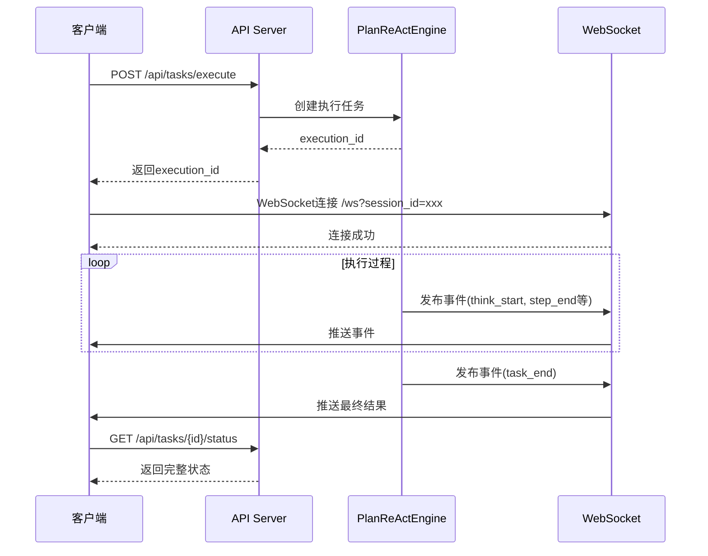
```mermaid
sequenceDiagram
    participant C as 客户端
    participant A as API Server
    participant E as PlanReActEngine
    participant W as WebSocket
    
    C->>A: POST /api/tasks/execute
    A->>E: 创建执行任务
    E-->>A: execution_id
    A-->>C: 返回execution_id
    
    C->>W: WebSocket连接 /ws?session_id=xxx
    W-->>C: 连接成功
    
    loop 执行过程
        E->>W: 发布事件(think_start, step_end等)
        W->>C: 推送事件
    end
    
    E->>W: 发布事件(task_end)
    W->>C: 推送最终结果
    
    C->>A: GET /api/tasks/{id}/status
    A-->>C: 返回完整状态
```

WebSocket通信流程：

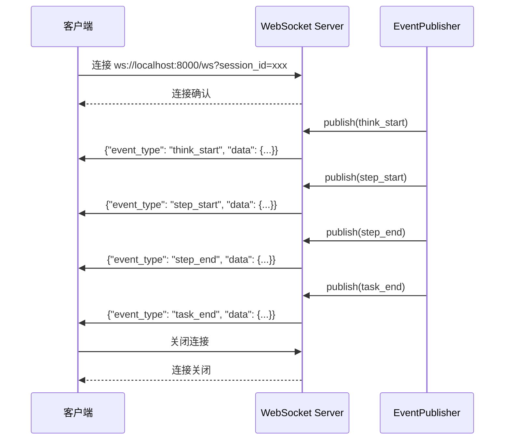
```mermaid
sequenceDiagram
    participant C as 客户端
    participant W as WebSocket Server
    participant P as EventPublisher
    
    C->>W: 连接 ws://localhost:8000/ws?session_id=xxx
    W-->>C: 连接确认
    
    P->>W: publish(think_start)
    W->>C: {"event_type": "think_start", "data": {...}}
    
    P->>W: publish(step_start)
    W->>C: {"event_type": "step_start", "data": {...}}
    
    P->>W: publish(step_end)
    W->>C: {"event_type": "step_end", "data": {...}}
    
    P->>W: publish(task_end)
    W->>C: {"event_type": "task_end", "data": {...}}
    
    C->>W: 关闭连接
    W-->>C: 连接关闭
```

8.5 数据模型定义

核心数据模型：

| 模型 | 字段 | 类型 | 说明 |
|-----|-----|-----|-----|
| Session | session_id | str | 会话唯一标识 |
| | user_name | str | 用户名 |
| | created_at | datetime | 创建时间 |
| | updated_at | datetime | 更新时间 |
| Message | role | str | 角色(user/assistant) |
| | content | str | 消息内容 |
| | timestamp | float | 时间戳 |
| Checkpoint | session_id | str | 会话ID |
| | task | str | 任务描述 |
| | plan | List[dict] | 执行计划 |
| | current_step_idx | int | 当前步骤索引 |
| | execution_status | str | 执行状态 |
| | replan_count | int | 重规划次数 |
| ExecutionStatus | execution_id | str | 执行ID |
| | task | str | 任务描述 |
| | task_level | str | 任务级别 |
| | model | str | 使用模型 |
| | status | str | 执行状态 |
| | current_step | int | 当前步骤 |
| | total_steps | int | 总步骤数 |
    task: str
    task_level: str
    model: str
    status: str
    current_step: int
    total_steps: int
    created_at: float
    updated_at: float
```

九、事件驱动架构（V4.0新增）

9.1 事件系统概述

V4.0版本引入事件驱动架构，统一处理执行过程中的各类事件，解耦输出逻辑：

```
执行引擎 → global_event_publisher → 订阅者
                                        ├── ConsoleSubscriber（控制台输出）
                                        ├── WebSocketSubscriber（前端推送）
                                        └── SessionStoreSubscriber（会话存储）
```

9.2 事件类型

| 事件名称 | 触发时机 | 携带数据 |
|---------|---------|---------|
| think_start | 思考开始 | session_id, execution_id |
| think_stream | 思考流式输出 | session_id, execution_id, content |
| think_final | 思考完成 | session_id, execution_id, thought |
| plan_start | 计划开始 | session_id, execution_id |
| plan_final | 计划完成 | session_id, execution_id, plan |
| step_start | 步骤开始 | session_id, execution_id, step_index, description |
| step_end | 步骤结束 | session_id, execution_id, step_index, result, status |
| task_start | 任务开始 | session_id, execution_id, task_input |
| task_end | 任务结束 | session_id, execution_id, result |
| task_failed | 任务失败 | session_id, execution_id, error |

9.3 事件发布流程

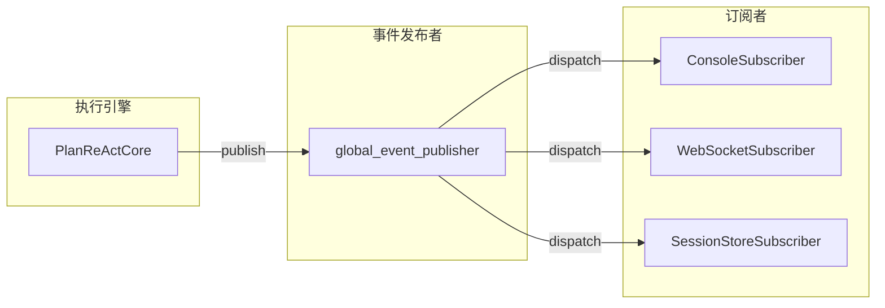
```mermaid
flowchart LR
    subgraph 执行引擎
        A[PlanReActCore]
    end
    
    subgraph 事件发布者
        B[global_event_publisher]
    end
    
    subgraph 订阅者
        C[ConsoleSubscriber]
        D[WebSocketSubscriber]
        E[SessionStoreSubscriber]
    end
    
    A -->|publish| B
    B -->|dispatch| C
    B -->|dispatch| D
    B -->|dispatch| E
```

事件发布时序：

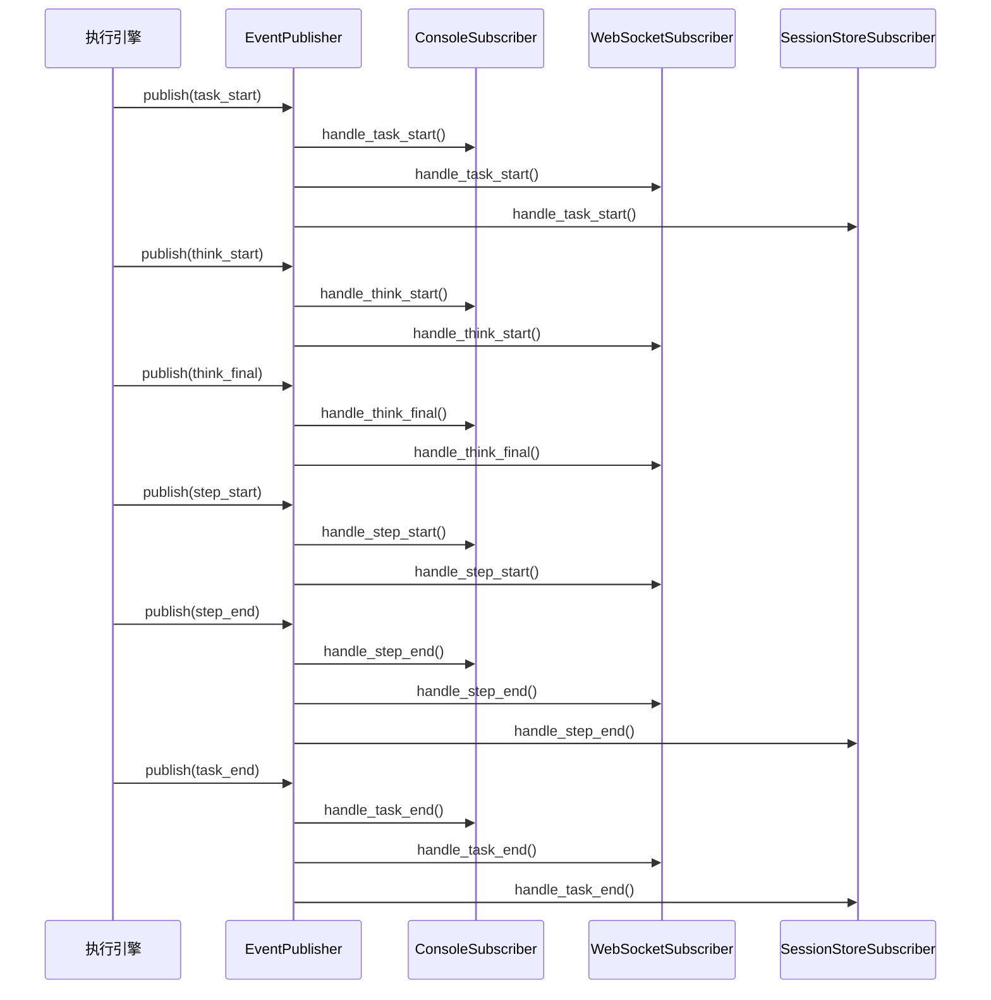
```mermaid
sequenceDiagram
    participant E as 执行引擎
    participant P as EventPublisher
    participant C as ConsoleSubscriber
    participant W as WebSocketSubscriber
    participant S as SessionStoreSubscriber
    
    E->>P: publish(task_start)
    P->>C: handle_task_start()
    P->>W: handle_task_start()
    P->>S: handle_task_start()
    
    E->>P: publish(think_start)
    P->>C: handle_think_start()
    P->>W: handle_think_start()
    
    E->>P: publish(think_final)
    P->>C: handle_think_final()
    P->>W: handle_think_final()
    
    E->>P: publish(step_start)
    P->>C: handle_step_start()
    P->>W: handle_step_start()
    
    E->>P: publish(step_end)
    P->>C: handle_step_end()
    P->>W: handle_step_end()
    P->>S: handle_step_end()
    
    E->>P: publish(task_end)
    P->>C: handle_task_end()
    P->>W: handle_task_end()
    P->>S: handle_task_end()
```

9.4 订阅者职责

| 订阅者 | 职责 | 订阅事件 |
|-------|-----|---------|
| ConsoleSubscriber | 控制台输出美化 | think_*, plan_*, step_*, task_* |
| WebSocketSubscriber | 前端实时推送 | think_*, plan_*, step_*, task_* |
| SessionStoreSubscriber | 会话持久化 | plan_final, step_end, task_end |

9.5 事件驱动优势

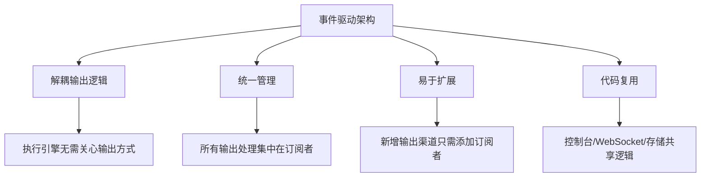
```mermaid
flowchart TD
    A[事件驱动架构] --> B[解耦输出逻辑]
    A --> C[统一管理]
    A --> D[易于扩展]
    A --> E[代码复用]
    
    B --> B1[执行引擎无需关心输出方式]
    C --> C1[所有输出处理集中在订阅者]
    D --> D1[新增输出渠道只需添加订阅者]
    E --> E1[控制台/WebSocket/存储共享逻辑]
```

十、提示词模板化管理（V4.0新增）

10.1 PromptTemplates 架构

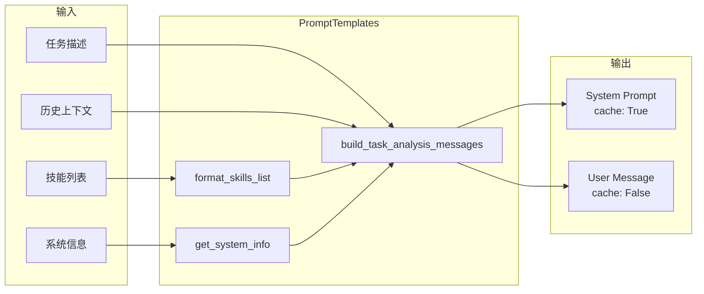
```mermaid
flowchart LR
    subgraph 输入
        A[任务描述]
        B[历史上下文]
        C[技能列表]
        D[系统信息]
    end
    
    subgraph PromptTemplates
        E[get_system_info]
        F[format_skills_list]
        G[build_task_analysis_messages]
    end
    
    subgraph 输出
        H[System Prompt<br/>cache: True]
        I[User Message<br/>cache: False]
    end
    
    A --> G
    B --> G
    C --> F --> G
    D --> E --> G
    G --> H
    G --> I
```

10.2 上下文缓存机制

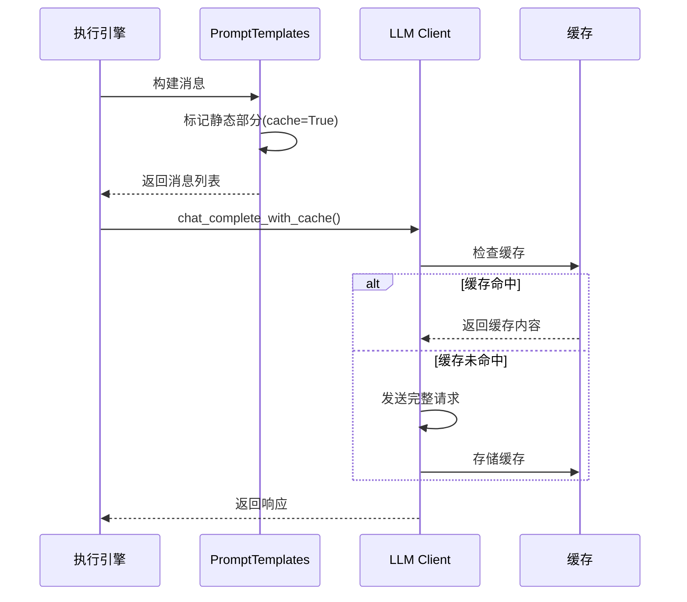
```mermaid
sequenceDiagram
    participant E as 执行引擎
    participant P as PromptTemplates
    participant L as LLM Client
    participant C as 缓存
    
    E->>P: 构建消息
    P->>P: 标记静态部分(cache=True)
    P-->>E: 返回消息列表
    
    E->>L: chat_complete_with_cache()
    L->>C: 检查缓存
    alt 缓存命中
        C-->>L: 返回缓存内容
    else 缓存未命中
        L->>L: 发送完整请求
        L->>C: 存储缓存
    end
    L-->>E: 返回响应
```

缓存效果：

| 内容类型 | 缓存策略 | Token节省 |
|---------|---------|----------|
| System Prompt | cache=True | 约500 tokens/次 |
| 技能列表 | cache=True | 约200 tokens/次 |
| 用户任务 | cache=False | 0 |
| 历史上下文 | cache=False | 0 |

10.3 提示词统一管理优势

1. **集中维护**：所有提示词在一个类中管理，便于版本控制
2. **参数化模板**：支持动态参数注入，提高复用性
3. **上下文缓存**：减少重复Token消耗，降低成本
4. **易于测试**：提示词逻辑独立，便于单元测试

十一、总结

11.1 V4.0 架构优化总结

| 优化项 | V3.0 | V4.0 | 收益 |
|-------|------|------|------|
| 执行入口 | ReActEngine + PlanReActEngine | 统一 PlanReActEngine | 减少代码分支 |
| 引擎继承 | 独立实现 | PlanReActCore 继承 ReActCore | 复用执行逻辑 |
| LLM调用次数 | simple: 2次, complex: N+2次 | simple: 1次, complex: N+1次 | 减少50%/1次 |
| 输出处理 | 手动流式处理 | 事件订阅者模式 | 解耦、易扩展 |
| 提示词管理 | 分散在各处 | PromptTemplates 集中管理 | 易维护、支持缓存 |
| 方法数量 | _execute_task_sync + _execute_task_stream | 统一 _execute_task_stream | 减少重复代码 |

11.2 核心功能保留

✅ 任务自动分级（三级）  
✅ 统一执行入口智能路由  
✅ MCP/Skill能力调用  
✅ 会话历史与检查点  
✅ 基础重规划能力  
✅ 本地日志记录  
✅ 步骤断点重试  
✅ 检查点自动管理  
✅ 任务状态恢复  
✅ 事件驱动架构  
✅ 提示词模板化管理  
✅ RESTful API和WebSocket服务  

11.3 后续可选扩展

本地LLM：集成Ollama，实现完全离线运行
RAG增强：添加本地文档知识库
定时任务：支持计划任务执行
插件系统：支持第三方插件扩展

文档版本：V4.0（架构重构版，统一执行入口，事件驱动架构，提示词模板化管理）  
更新日期：2026-03-01  
适用场景：个人本地使用，轻量级部署，支持桌面端客户端接入